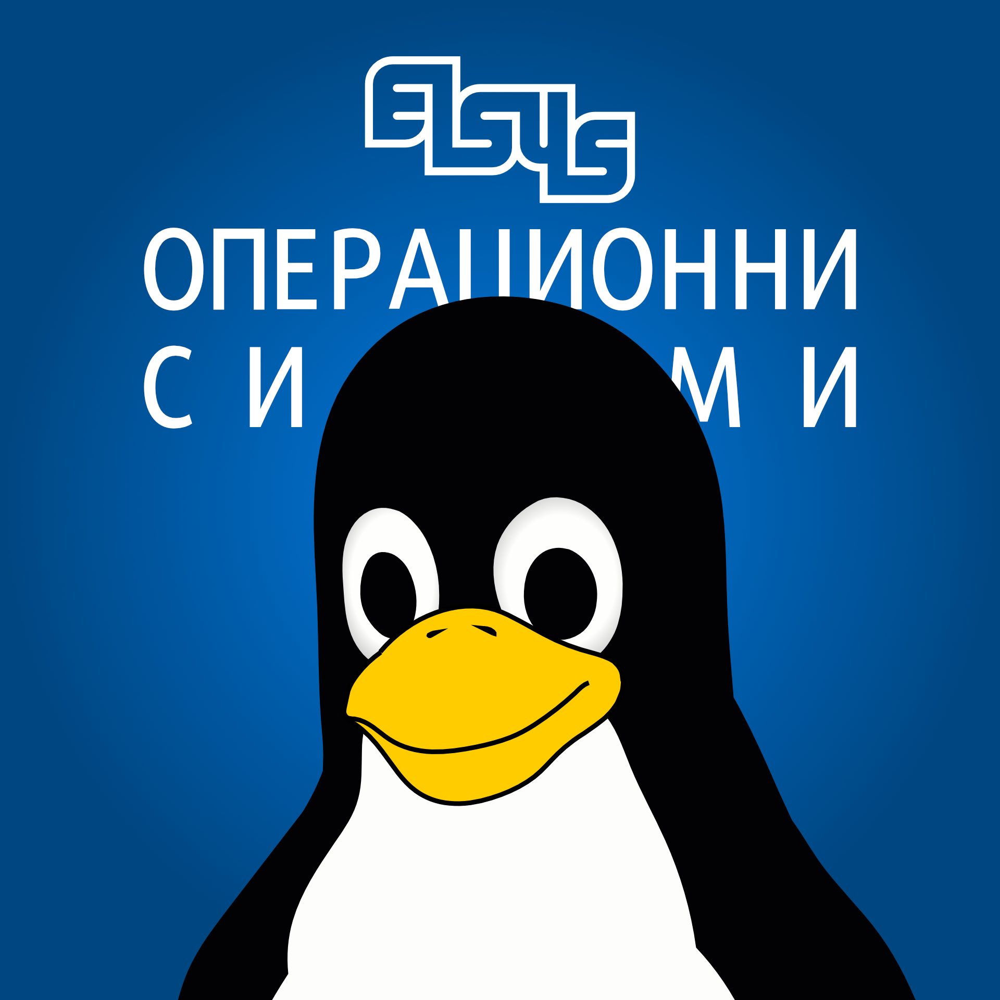

  
  <h1 align="center">Операционни системи - ТУЕС 2026-2027 г. - 11„А“ клас</h1>
  

    Презентации и материали за курса по операционни системи в ТУЕС за учебната 2026-2027
    година.
  

    

## Теми

### Теория

<!-- - [Тема 0: Структура на курса по операционни системи.](./theory/00-course-structure) -->
<!-- - [Тема 1: Структура на компютърните системи.](./theory/01-computer-systems-structure) -->
<!-- - [Тема 2: Компютърни системи. (продължение)](./theory/02-computer-systems-continuation) -->
<!-- - [Тема 3: Въведение в операционните системи.](./theory/03-operating-systems-introduction) -->
<!-- - [Тема 4: Нишки и синхронизация.](./theory/04-threads-and-syncronization) -->
  <!-- - [Тема 5: Комуникация между процеси посредством тръби (pipes).](./theory/05-process-communication-with-pipes/) -->
  <!-- - [Тема 5.1. Shell променливи - дефиниране, инициализиране, присвояване. Системни променливи. Командна процедура (shell scripts)](./theory/05-shellscripts/05.1-shell-variables-and-shellscripts/) -->
  <!-- - [Тема 5.2. Kомандни процедури без и с позиционни параметри. Цикли.](./theory/05-shellscripts/05.2-shellscripts-and-loops/) -->
  <!-- - [Тема 6: Файлове и файлови системи.](./theory/06-files-and-filesystems/) -->
  <!-- - [Тема 7: Сокети и мрежова комуникация.](./theory/07-sockets/) -->

### Практика

<!-- - [Тема 1: Работа с файлове. (open, close, read, write, lseek)](./practice/01-file-descriptors/)
- [Тема 2: Работа с процеси. (pipe, exec, wait, kill)](./practice/02-processes/) -->
  <!-- - [Тема 4: Работа с нишки и синхронизация чрез Mutex. (pthread)](./practice/04-threads/) -->
  <!-- - [Тема 5: Работа със неименувани и наименувани семафори. (pthread_mutex, sem_wait, sem_post)](./practice/05-semaphores/) -->
  <!-- - [Тема 6: Тръби и комуникация между процеси. (pipe, pipe2)](./practice/06-pipes/) -->
  <!-- - [Тема 7: Shell scripts.](./practice/07-shell-scripting/) -->
  <!-- - [Тема 8: Работа с TCP socket-и и мрежова комуникация. (socket, bind, listen, accept)](./practice/08-sockets/) -->
  <!-- - [Тема 9: Работа с файлови системи и файлове. (stat)](./practice/09-stat/) -->

## Ресурси за курса

- Курс в Google Classroom

  [Линк](https://classroom.google.com/c/ODg2MTg2ODU5OTM4)

- GitHub хранилище

  [Линк](https://youtu.be/dQw4w9WgXcQ)
  (oh wait, you're already here 😅)

- Контакт
  - <apenchev@elsys-bg.org>
  - [angel@penchev.dev](mailto:angel@penchev.dev)
